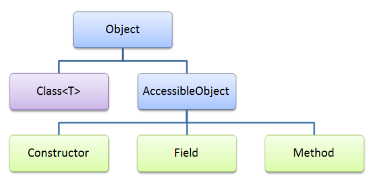

# This is Java Reflection Learning
-  truy cập, sửa đổi cấu trúc và hành vi của một đối tượng tại thời gian chạy (runtime)

## resource
- https://gpcoder.com/2883-huong-dan-su-dung-java-reflection/ 
- 