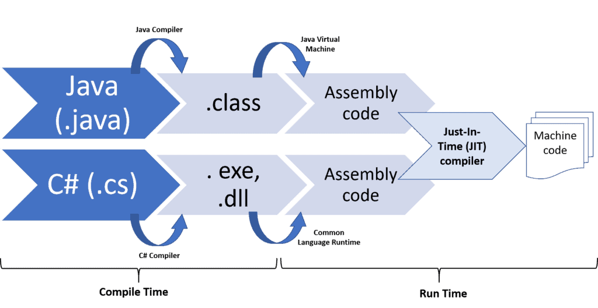

- anotation -> metadata 
- compile time -> build time -> run time

- resource 
- https://codelearn.io/sharing/annotation-trong-java-la-gi 
- https://gpcoder.com/2850-huong-dan-su-dung-java-annotation/
